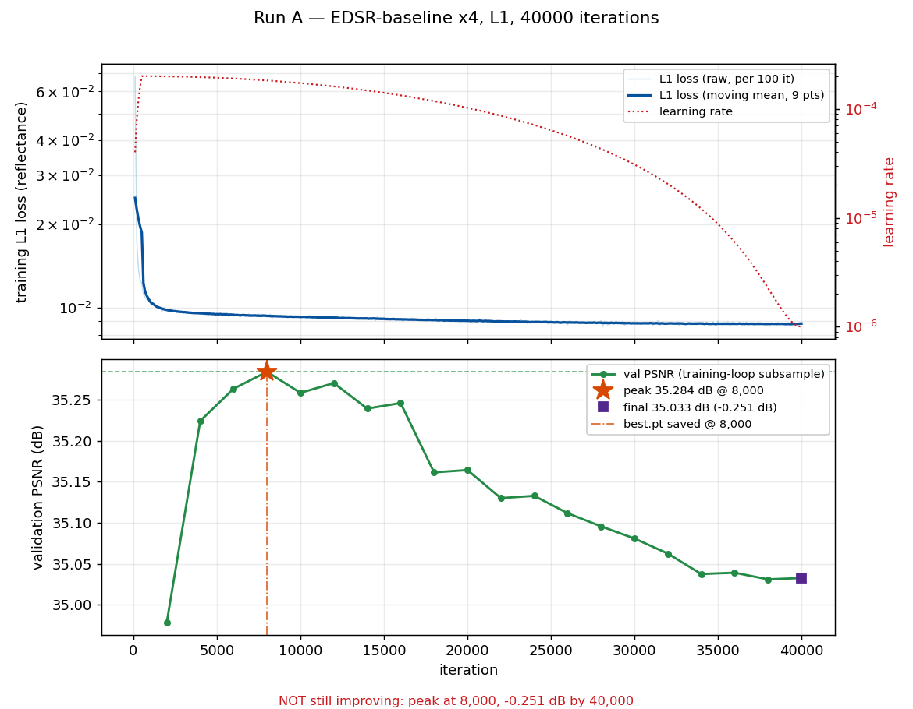

# Day 2 — Run A (EDSR-baseline, L1) against the bicubic floor

**GATE PASSED** -- edsr_runA beats bicubic on all 3 gate metrics (PSNR up, SSIM up, LPIPS down) over the full validation split.

_Written 2026-09-07T16:18:43+00:00._ Dataset `sen2naipv2`, split `val`, **1199 patches** from 300 tiles, x4. Split source: `splits_sen2naipv2.csv`. Evaluated on cpu with 6 torch threads.

---

## 1. The gate

The criterion, from `cfg.eval_runA.gate`: the model must improve on bicubic on **every** one of PSNR (higher), SSIM (higher) and LPIPS (lower). Two of three is a fail.

| metric | better | bicubic | edsr_runA | delta | verdict |
|---|---|---|---|---|---|
| `psnr_mean` | higher | 38.4717 | 38.8260 | +0.3543 | PASS |
| `ssim_mean` | higher | 0.8825 | 0.8896 | +0.0072 | PASS |
| `lpips` | lower | 0.4033 | 0.3219 | -0.0814 | PASS |

## 2. Full metric tables

Both methods scored by the same `src.metrics.aggregate.Evaluator`, in the same pass, over the same loader. PSNR and SSIM are means over all 4 bands (B04, B03, B02, B08); the per-band columns are in the CSVs. LPIPS is computed on the RGB bands only (B04, B03, B02), scaled to [-1, 1].

**bicubic** -- sen2naipv2 / val split, 1199 patches, x4

| metric | better | mean | std | p5 | p95 | min | max | n |
|---|---|---|---|---|---|---|---|---|
| psnr_mean | higher | 38.4717 | 4.8570 | 30.1668 | 46.3490 | 24.1767 | 52.2379 | 1199 |
| ssim_mean | higher | 0.8825 | 0.0823 | 0.7139 | 0.9771 | 0.5202 | 0.9938 | 1199 |
| sam_mean_deg | lower | 2.0925 | 1.1103 | 0.7498 | 4.3908 | 0.4418 | 10.1505 | 1199 |
| sam_p95_deg | lower | 5.9250 | 3.5901 | 1.8318 | 11.8500 | 0.9839 | 65.3642 | 1199 |
| ergas | lower | 3.0503 | 1.5648 | 1.0666 | 6.0705 | 0.6404 | 11.7680 | 1199 |
| lpips | lower | 0.4033 | 0.1371 | 0.1529 | 0.6205 | 0.0192 | 0.7480 | 1199 |
| psnr_B04 | higher | 37.2018 | 4.9317 | 29.0185 | 45.3515 | 23.2876 | 51.7001 | 1199 |
| psnr_B03 | higher | 40.0533 | 5.4874 | 30.5646 | 48.9725 | 23.8603 | 53.9466 | 1199 |
| psnr_B02 | higher | 41.6258 | 5.6909 | 31.4051 | 50.3398 | 24.2540 | 54.6509 | 1199 |
| psnr_B08 | higher | 35.0057 | 4.4324 | 28.3463 | 42.8187 | 24.4479 | 49.0367 | 1199 |
| ssim_B04 | higher | 0.8666 | 0.0953 | 0.6774 | 0.9768 | 0.5058 | 0.9939 | 1199 |
| ssim_B03 | higher | 0.9104 | 0.0821 | 0.7377 | 0.9892 | 0.5047 | 0.9963 | 1199 |
| ssim_B02 | higher | 0.9292 | 0.0740 | 0.7703 | 0.9919 | 0.5247 | 0.9968 | 1199 |
| ssim_B08 | higher | 0.8237 | 0.1021 | 0.6368 | 0.9615 | 0.4650 | 0.9889 | 1199 |
| sam_undefined_px | higher | 0.5530 | 15.5715 | 0.0000 | 0.0000 | 0.0000 | 520.0000 | 1199 |
| lpips_clipped_frac | higher | 8.904e-05 | 0.0011 | 0.0000 | 0.0000 | 0.0000 | 0.0233 | 1199 |
| hr_reflectance_mean | higher | 0.1404 | 0.0369 | 0.0945 | 0.2036 | 0.0466 | 0.4611 | 1199 |
| sr_reflectance_mean | higher | 0.1404 | 0.0372 | 0.0946 | 0.2039 | 0.0462 | 0.4662 | 1199 |
| sr_reflectance_min | higher | 0.0277 | 0.0184 | 0.0023 | 0.0628 | -0.0165 | 0.1129 | 1199 |
| sr_reflectance_max | higher | 0.4378 | 0.1390 | 0.2586 | 0.6681 | 0.1866 | 1.4535 | 1199 |
| sr_time_ms | higher | 0.6557 | 0.3272 | 0.5282 | 1.9662 | 0.3907 | 2.0697 | 1199 |

> **LPIPS caveat.** LPIPS is a perceptual proxy: its backbone was trained on natural RGB photographs, not on multispectral surface reflectance. On satellite data it is indicative of perceptual sharpness, not authoritative. It sees only the RGB bands, ignores NIR entirely, and requires reflectance to be clipped into [0, 1] before use. Rank models by PSNR/SSIM/SAM/ERGAS; read LPIPS as a tie-breaker on apparent detail.

**edsr_runA** -- sen2naipv2 / val split, 1199 patches, x4

| metric | better | mean | std | p5 | p95 | min | max | n |
|---|---|---|---|---|---|---|---|---|
| psnr_mean | higher | 38.8260 | 4.7424 | 30.4284 | 46.4266 | 24.6287 | 51.5706 | 1199 |
| ssim_mean | higher | 0.8896 | 0.0767 | 0.7359 | 0.9770 | 0.5310 | 0.9938 | 1199 |
| sam_mean_deg | lower | 2.0219 | 1.0117 | 0.8534 | 4.0936 | 0.5723 | 9.7009 | 1199 |
| sam_p95_deg | lower | 5.6327 | 3.4390 | 1.9134 | 11.1265 | 1.1758 | 63.2536 | 1199 |
| ergas | lower | 2.9036 | 1.4668 | 1.0422 | 5.7652 | 0.6837 | 10.8074 | 1199 |
| lpips | lower | 0.3219 | 0.1157 | 0.1253 | 0.5129 | 0.0181 | 0.6633 | 1199 |
| psnr_B04 | higher | 37.6366 | 4.8499 | 29.6259 | 45.6817 | 23.8042 | 51.6567 | 1199 |
| psnr_B03 | higher | 40.3603 | 5.3122 | 30.9661 | 48.7570 | 24.2195 | 52.9921 | 1199 |
| psnr_B02 | higher | 42.0377 | 5.6045 | 31.8617 | 50.5078 | 24.6641 | 54.9608 | 1199 |
| psnr_B08 | higher | 35.2693 | 4.2750 | 28.6558 | 42.6019 | 24.8915 | 47.0699 | 1199 |
| ssim_B04 | higher | 0.8765 | 0.0881 | 0.7028 | 0.9776 | 0.5153 | 0.9939 | 1199 |
| ssim_B03 | higher | 0.9164 | 0.0763 | 0.7599 | 0.9896 | 0.5193 | 0.9963 | 1199 |
| ssim_B02 | higher | 0.9346 | 0.0681 | 0.7908 | 0.9922 | 0.5371 | 0.9970 | 1199 |
| ssim_B08 | higher | 0.8310 | 0.0974 | 0.6495 | 0.9624 | 0.4970 | 0.9888 | 1199 |
| sam_undefined_px | higher | 0.0801 | 2.7724 | 0.0000 | 0.0000 | 0.0000 | 96.0000 | 1199 |
| lpips_clipped_frac | higher | 4.765e-05 | 6.743e-04 | 0.0000 | 0.0000 | 0.0000 | 0.0134 | 1199 |
| hr_reflectance_mean | higher | 0.1404 | 0.0369 | 0.0945 | 0.2036 | 0.0466 | 0.4611 | 1199 |
| sr_reflectance_mean | higher | 0.1398 | 0.0367 | 0.0945 | 0.2033 | 0.0474 | 0.4584 | 1199 |
| sr_reflectance_min | higher | 0.0293 | 0.0184 | 0.0029 | 0.0647 | -0.0240 | 0.1135 | 1199 |
| sr_reflectance_max | higher | 0.4365 | 0.1377 | 0.2591 | 0.6628 | 0.1883 | 1.4286 | 1199 |
| sr_time_ms | higher | 123.7763 | 16.3238 | 116.3201 | 135.8582 | 112.3025 | 235.1045 | 1199 |

> **LPIPS caveat.** LPIPS is a perceptual proxy: its backbone was trained on natural RGB photographs, not on multispectral surface reflectance. On satellite data it is indicative of perceptual sharpness, not authoritative. It sees only the RGB bands, ignores NIR entirely, and requires reflectance to be clipped into [0, 1] before use. Rank models by PSNR/SSIM/SAM/ERGAS; read LPIPS as a tie-breaker on apparent detail.

## 3. The model

- **Architecture** — EDSR-baseline, 16 residual blocks, 64 features, 4-channel in and out (RGBN), x4 PixelShuffle upsampler, no batch norm.
- **Parameters** — 1,518,724.
- **Checkpoint** — `D:/SIH/DrishtiSR/runs/runA/best.pt`, saved at iteration 8,000 with a recorded best validation PSNR of 35.2842 dB.

> **PARAMETER BUDGET EXCEEDED.** 1,518,724 parameters against the 1,000,000 limit in `cfg.runtime.max_parameters` — 1.52x over. Run A is a **reference measurement**, not a deliverable: it establishes what a conventional EDSR achieves on this split so the budgeted model can be compared to something real. The submitted model must fit the budget, and this number must not be quoted as a result without this sentence attached.

> **Note on the checkpoint's own validation number.** The 35.2842 dB recorded in the checkpoint comes from the training loop's periodic validation, which covers only `--val-batches` (25) batches and runs under AMP. The table above is the full split in float32 and is the number that counts; they are not expected to agree exactly.

## 4. Training curves



**Was it still improving at 40000k?** Validation was NOT still improving at 40,000 iterations: it peaked at 35.284 dB at iteration 8,000 (16% of the way through) and ended at 35.033 dB, -0.251 dB from the peak, with the final 25% sloping -0.0033 dB per 1k iterations. The run is NOT undertrained; the extra iterations after the peak bought nothing.

- Peak validation PSNR **35.2842 dB** at iteration **8,000**; final **35.0328 dB** at **40,000** (-0.2514 dB).
- Slope over the last 25% of the run: **-0.0033 dB per 1k iterations**.

## 5. Reproducing this

```
D:\SIH\DrishtiSR\.venv\Scripts\python.exe scripts/eval_runA.py
```

Bicubic was **re-scored in this pass**, not quoted from Day 1. The Day 1 stored value is 38.4717 dB PSNR against 38.4717 dB here; they agree, so the split and the metric settings have not moved.

Per-patch rows: `D:/SIH/DrishtiSR/outputs/metrics/day2_runA_bicubic.csv`, `D:/SIH/DrishtiSR/outputs/metrics/day2_runA_edsr_runA.csv`.

> **LPIPS caveat.** LPIPS is a perceptual proxy: its backbone was trained on natural RGB photographs, not on multispectral surface reflectance. On satellite data it is indicative of perceptual sharpness, not authoritative. It sees only the RGB bands, ignores NIR entirely, and requires reflectance to be clipped into [0, 1] before use. Rank models by PSNR/SSIM/SAM/ERGAS; read LPIPS as a tie-breaker on apparent detail.
