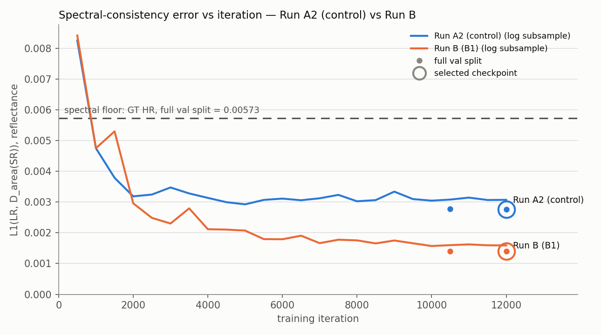

# Day 3 — headline results: post-hoc checkpoint selection, and is B − A2 noise?

_Generated 2026-09-10T08:15:33+00:00 by `scripts/eval_all_ckpts.py`._ Dataset `sen2naipv2`, split `val`, **1199 validation pairs**, every method scored on the identical patches, CPU, float32.

## The reading

Run B lowers opensr-test's consistency error (`reflectance`) from 0.00320 to 0.00213 (-33.3%); the tile-clustered 95% CI on the per-pair mean delta is [-0.00113, -0.001], and the CI excludes zero, so this consistency gain is resolved, not noise. B costs 0.105 dB PSNR against A2 (tile CI [-0.113, -0.0979] dB, resolved), and moves LPIPS by +0.0130 (resolved).

> **Every learned model is already below the spectral floor** (L1_spec 0.00573, the ground-truth HR's own value): Run A ¹, Run A2 (control), Run B (B1), Run B2. The floor is therefore not a lower bound on consistency error. An L1-trained network regresses toward the conditional mean, which is smoother and closer to the Sentinel-2 PSF than the real NAIP-derived HR. Pushing consistency further down moves the output further from the HR's own behaviour. The floor is a reference point, not a lower bound: going below it is a warning sign for over-smoothing, not an achievement (`reports/day3_spectral_floor.md`).

> **Most checkpoints did not survive a trainer bug** (`runA` 2 of 16, `a2` 2 of 12, `b1` 2 of 12, `b2` 2 of 12). `src/train.py` wrote every scheduled checkpoint to the same `last.pt`, each overwriting the one before, so a finished run kept only `last.pt` and the PSNR-chosen `best.pt`. The selection rule was applied to those survivors and nothing else. The dense curve in §5 is the training loop's own validation (400 patches, AMP): the trajectory, not selection data. The trainer now keeps every checkpoint as `ckpt_it<NNNNNN>.pt`, and this script scores every `*.pt` in a run directory, so a rerun gets the full sweep unchanged.

> **Run A2 (control), Run B (B1), Run B2 selected the final iterate.** The rule picked the last checkpoint on disk, and no earlier checkpoint was tied with it (§4), so `reflectance` was still improving when training stopped. By the selection criterion, none of these runs had converged at 12,000 iterations.

## 1. The selection rule (stated before the full-split results)

For each run, independently and identically: the checkpoint with the lowest mean opensr-test `reflectance` (consistency error: L1 between the LR and the SR downsampled back to 10 m) is the minimum. Any checkpoint whose paired bootstrap 95% CI on (candidate − minimum) contains 0 is **tied** with it. The tied checkpoint with the best `lpips` (lower is better) is selected. `best.pt` was not used as a choice: it is only a filename here, scored like any other checkpoint. The same rule is applied to Run A.

> The rule (consistency first, LPIPS as tie-break) was set by the task before any results. Its two operational choices -- opensr-test `reflectance` as the consistency metric, and a CI-based tie -- were written into configs/base.yaml before any full-split evaluation ran. The training-loop validation logs (a 400-patch AMP subsample, not the selection data) had been read at that point.

### Checkpoints available — READ THIS

- `runA`: **2** checkpoint(s) on disk, at iterations 8,000, 40,000 — of the 16 its `--ckpt-every` schedule wrote.
- `a2`: **2** checkpoint(s) on disk, at iterations 10,500, 12,000 — of the 12 its `--ckpt-every` schedule wrote.
- `b1`: **2** checkpoint(s) on disk, at iterations 10,500, 12,000 — of the 12 its `--ckpt-every` schedule wrote.
- `b2`: **2** checkpoint(s) on disk, at iterations 5,500, 12,000 — of the 12 its `--ckpt-every` schedule wrote.

> The checkpoint caveats are stated under **The reading** above.

## 2. The table

| method | λ1 / λ2 | PSNR dB ↑ | SSIM ↑ | LPIPS ↓ | SAM° vs HR ↓ | ERGAS ↓ | opensr refl. L1 ↓ | opensr spectral° ↓ | opensr spatial px ↓ | L1_spec (D=area) ↓ | SAM_spec° (D=area) ↓ | L1_spec ÷ floor | params | iters (selected / trained) |
|---|---|---|---|---|---|---|---|---|---|---|---|---|---|---|
| Bicubic | — | 38.472 | 0.8825 | 0.4033 | 2.092 | 3.050 | 0.00217 | 0.5152 | 0.0062 | 0.001210 | 0.2925 | 0.21× | 0 | — |
| Run A ¹ | — | 38.826 | 0.8896 | 0.3219 | 2.022 | 2.904 | 0.00343 | 0.9004 | 0.0232 | 0.003114 | 0.8457 | 0.54× | 1,518,724 | 8,000 / 40,000 |
| Run A2 (control) | 0 / 0 | 38.871 | 0.8889 | 0.3322 | 1.972 | 2.897 | 0.00320 | 0.7642 | 0.0057 | 0.002761 | 0.6863 | 0.48× | 855,652 | 12,000 / 12,000 |
| Run B (B1) | 0.1 / 0.02 | 38.765 | 0.8881 | 0.3452 | 2.044 | 2.933 | 0.00213 | 0.4219 | 0.0023 | 0.001396 | 0.2118 | 0.24× | 855,652 | 12,000 / 12,000 |
| *GT HR as the SR — spectral floor* | — | — | — | — | — | — | *0.00478* | *1.0911* | *0.2027* | *0.005733* | *1.2748* | *1.00×* | — | — |

Supplementary (not one of the four rows; B1 was designated "the primary result" in `scripts/day3_runs.py::RUN_PLAN` before training):

| method | λ1 / λ2 | PSNR dB ↑ | SSIM ↑ | LPIPS ↓ | SAM° vs HR ↓ | ERGAS ↓ | opensr refl. L1 ↓ | opensr spectral° ↓ | opensr spatial px ↓ | L1_spec (D=area) ↓ | SAM_spec° (D=area) ↓ | L1_spec ÷ floor | params | iters (selected / trained) |
|---|---|---|---|---|---|---|---|---|---|---|---|---|---|---|
| Run B2 | 0.3 / 0.06 | 38.559 | 0.8864 | 0.3558 | 2.110 | 3.008 | 0.00134 | 0.3358 | 0.0012 | 0.000200 | 0.0523 | 0.03× | 855,652 | 12,000 / 12,000 |

¹ **Run A is not a controlled comparison.** It uses a different architecture (16 blocks × 64 features, **1,518,724 parameters, 1.52× the 1,000,000 budget**) and a different data pipeline: no augmentation, and weight decay 0.0001 against A2/B's 0.0 (`configs/frozen_day3.yaml`). It trained for 40,000 iterations, but its training-loop validation PSNR peaked at iteration 8,000 (35.284 dB), so the other 32,000 iterations bought nothing. It is the **training-efficiency observation**, the reason Day 3 runs 12k iterations, and not evidence about the spectral loss.

Columns: PSNR/SSIM over all four bands (RGBN); LPIPS on RGB only (see caveat); SAM and ERGAS against the HR. `opensr …` are opensr-test's consistency metrics (LR vs SR downsampled back to LR by its own antialiased bilinear). `L1_spec`/`SAM_spec` are the same comparison through the area operator the spectral loss trains on. `L1_spec ÷ floor` is that value as a multiple of the ground-truth HR's. `spatial` is NaN where satalign rejects a translation; those patches are excluded from that column only.

Floor cross-check: L1_spec of the GT HR here is 0.005733; `outputs/metrics/spectral_floor.json` holds 0.005733.

## 3. Is B − A2 noise? Per-pair significance

Run B at its selected checkpoint (it12000) minus Run A2 at its selected checkpoint (it12000), per validation pair, over all 1199 pairs. Bootstrap: 10,000 replicates, percentile 95% CI on the mean delta, seed `cfg.seed`. The **pairs** CI resamples patches independently, as specified. The **tiles** CI resamples the 300 source tiles and keeps each tile's patches together. Patches from one tile share a scene and a NAIP flight, so their deltas are correlated. The tile CI is the honest one, and every verdict uses it. Wilcoxon signed-rank is two-sided; "p (tile means)" runs it on per-tile mean deltas. No multiple-comparison correction is applied: the headline claim rests on one pre-declared metric (`reflectance`), and the rest are context.

| metric | better | A2 mean | B mean | mean Δ (B − A2) | 95% CI, pairs | 95% CI, tiles | Wilcoxon p (pairs) | p (tile means) | B better on | n | verdict (tile CI) |
|---|---|---:|---:|---:|---:|---:|---:|---:|---:|---:|---|
| `psnr_mean` | higher | 38.871 | 38.765 | -0.105 | [-0.11, -0.101] | [-0.113, -0.0979] | 1.3e-180 | 1e-48 | 6.8% | 1199 | **control better** |
| `ssim_mean` | higher | 0.8889 | 0.88808 | -0.000818 | [-0.00087, -0.000768] | [-0.000906, -0.000731] | 8.1e-171 | 3.5e-47 | 6.3% | 1199 | **control better** |
| `lpips` | lower | 0.33221 | 0.34524 | +0.013 | [+0.0124, +0.0137] | [+0.0118, +0.0142] | 1.1e-155 | 3.1e-43 | 14.2% | 1199 | **control better** |
| `sam_mean_deg` | lower | 1.9721 | 2.044 | +0.0719 | [+0.067, +0.0765] | [+0.0643, +0.0793] | 7.3e-185 | 3.9e-48 | 3.3% | 1199 | **control better** |
| `ergas` | lower | 2.8966 | 2.9333 | +0.0367 | [+0.0347, +0.0387] | [+0.0333, +0.0403] | 4.5e-173 | 2.7e-47 | 6.8% | 1199 | **control better** |
| `reflectance` | lower | 0.0031986 | 0.0021344 | -0.00106 | [-0.0011, -0.00103] | [-0.00113, -0.001] | 1.2e-197 | 6.1e-51 | 100.0% | 1199 | **treatment better** |
| `spectral` | lower | 0.76416 | 0.42188 | -0.342 | [-0.354, -0.331] | [-0.363, -0.322] | 1.2e-197 | 6.1e-51 | 100.0% | 1199 | **treatment better** |
| `spatial` | lower | 0.0057094 | 0.002257 | -0.00345 | [-0.00394, -0.00297] | [-0.00397, -0.00294] | 1.8e-34 | 2.8e-26 | 19.5% | 1199 | **treatment better** |
| `l1_spec` | lower | 0.0027611 | 0.0013964 | -0.00136 | [-0.00141, -0.00132] | [-0.00145, -0.00128] | 1.2e-197 | 6.1e-51 | 100.0% | 1199 | **treatment better** |
| `sam_spec_deg` | lower | 0.68629 | 0.21182 | -0.474 | [-0.49, -0.46] | [-0.502, -0.447] | 1.2e-197 | 6.1e-51 | 100.0% | 1199 | **treatment better** |
| `synthesis` | higher | 0.0040543 | 0.003764 | -0.00029 | [-0.000327, -0.000254] | [-0.000333, -0.000249] | 2.4e-155 | 4.3e-39 | 4.6% | 1199 | **control better** |
| `ha_metric` | lower | 0.12832 | 0.11608 | -0.0122 | [-0.014, -0.0105] | [-0.014, -0.0104] | 2.3e-146 | 4e-34 | 93.8% | 1199 | **treatment better** |
| `om_metric` | lower | 0.7525 | 0.77828 | +0.0258 | [+0.0232, +0.0283] | [+0.023, +0.0285] | 3.6e-158 | 1.3e-39 | 5.0% | 1199 | **control better** |
| `im_metric` | higher | 0.11918 | 0.10564 | -0.0135 | [-0.0145, -0.0126] | [-0.0147, -0.0123] | 3.7e-168 | 8.7e-44 | 4.4% | 1199 | **control better** |

**Same comparison at matched iterations** (both runs' checkpoints at the same step). This guards against the selection having picked different iterations:

| iteration | metric | mean Δ (B − A2) | CI, tiles | verdict |
|---|---|---:|---:|---|
| it10500 | `psnr_mean` | -0.101 | [-0.108, -0.0938] | control better |
| it10500 | `reflectance` | -0.00108 | [-0.00114, -0.00101] | treatment better |
| it12000 | `psnr_mean` | -0.105 | [-0.113, -0.0979] | control better |
| it12000 | `reflectance` | -0.00106 | [-0.00113, -0.001] | treatment better |

## 4. Selection curves (full split, every checkpoint that exists)

**Run A** (`runA`) — selected **it08000** (files: best.pt).

| checkpoint | files | mean `reflectance` | Δ vs min | CI vs min | tied | mean `lpips` | selected |
|---|---|---:|---:|---:|:--:|---:|:--:|
| it08000 | best.pt | 0.003428 | +0 | — | yes | 0.3219 | **◉** |
| it40000 | last.pt | 0.003573 | +0.000144 | [+0.00012, +0.00017] | no | 0.3039 |  |

**Run A2 (control)** (`a2`) — selected **it12000** (files: last.pt).

| checkpoint | files | mean `reflectance` | Δ vs min | CI vs min | tied | mean `lpips` | selected |
|---|---|---:|---:|---:|:--:|---:|:--:|
| it10500 | best.pt | 0.003228 | +2.95e-05 | [+2.64e-05, +3.27e-05] | no | 0.3342 |  |
| it12000 | last.pt | 0.003199 | +0 | — | yes | 0.3322 | **◉** |

**Run B (B1)** (`b1`) — selected **it12000** (files: last.pt).

| checkpoint | files | mean `reflectance` | Δ vs min | CI vs min | tied | mean `lpips` | selected |
|---|---|---:|---:|---:|:--:|---:|:--:|
| it10500 | best.pt | 0.002152 | +1.75e-05 | [+1.65e-05, +1.86e-05] | no | 0.3461 |  |
| it12000 | last.pt | 0.002134 | +0 | — | yes | 0.3452 | **◉** |

**Run B2** (`b2`) — selected **it12000** (files: last.pt).

| checkpoint | files | mean `reflectance` | Δ vs min | CI vs min | tied | mean `lpips` | selected |
|---|---|---:|---:|---:|:--:|---:|:--:|
| it05500 | best.pt | 0.001667 | +0.000322 | [+0.000311, +0.000334] | no | 0.3579 |  |
| it12000 | last.pt | 0.001344 | +0 | — | yes | 0.3558 | **◉** |

## 5. Consistency vs iteration



Lines: the training loop's validation (`log.csv`, every 500 iterations, 400-patch subsample, AMP). Markers: the full split at the checkpoints that exist; the ring marks the selected one. Dashed: the spectral floor, the GT HR on the full split, in the same D=area units. The full training-loop curve for both runs, all rows:

| iter | Run A2 (control) val_l1_spec | Run A2 (control) val_sam | Run A2 (control) val_psnr | Run A2 (control) val_lpips | Run B (B1) val_l1_spec | Run B (B1) val_sam | Run B (B1) val_psnr | Run B (B1) val_lpips |
|---:|---:|---:|---:|---:|---:|---:|---:|---:|
| 500 | 0.008251 | 0.047635 | 33.419 | 0.51816 | 0.008415 | 0.044758 | 33.251 | 0.51125 |
| 1000 | 0.0047482 | 0.025865 | 34.666 | 0.44002 | 0.0047513 | 0.02827 | 34.574 | 0.43931 |
| 1500 | 0.0037869 | 0.017994 | 34.95 | 0.42047 | 0.0052961 | 0.021097 | 34.609 | 0.42916 |
| 2000 | 0.0031846 | 0.016747 | 35.103 | 0.40991 | 0.0029574 | 0.016904 | 35.032 | 0.41643 |
| 2500 | 0.0032432 | 0.014265 | 35.131 | 0.40503 | 0.0024854 | 0.013653 | 35.102 | 0.4143 |
| 3000 | 0.0034738 | 0.015902 | 35.138 | 0.40474 | 0.0023017 | 0.01003 | 35.116 | 0.41201 |
| 3500 | 0.0032792 | 0.016049 | 35.187 | 0.40014 | 0.002794 | 0.016883 | 35.066 | 0.41405 |
| 4000 | 0.0031347 | 0.013965 | 35.221 | 0.39511 | 0.0021171 | 0.0085068 | 35.158 | 0.40861 |
| 4500 | 0.0029947 | 0.013939 | 35.219 | 0.39306 | 0.0021041 | 0.0083143 | 35.158 | 0.40914 |
| 5000 | 0.0029255 | 0.012905 | 35.231 | 0.38959 | 0.0020717 | 0.0083804 | 35.15 | 0.40544 |
| 5500 | 0.0030692 | 0.013691 | 35.231 | 0.38725 | 0.0017952 | 0.0065646 | 35.164 | 0.40451 |
| 6000 | 0.0031116 | 0.014813 | 35.249 | 0.38694 | 0.0017906 | 0.0063296 | 35.189 | 0.40257 |
| 6500 | 0.0030583 | 0.013161 | 35.254 | 0.38666 | 0.0019064 | 0.0066385 | 35.192 | 0.4036 |
| 7000 | 0.0031223 | 0.014324 | 35.269 | 0.38705 | 0.0016636 | 0.0056866 | 35.199 | 0.40436 |
| 7500 | 0.0032327 | 0.013961 | 35.282 | 0.38222 | 0.0017756 | 0.0055963 | 35.203 | 0.40153 |
| 8000 | 0.003025 | 0.013615 | 35.266 | 0.37955 | 0.0017546 | 0.0059868 | 35.175 | 0.39925 |
| 8500 | 0.0030627 | 0.013513 | 35.273 | 0.37962 | 0.0016553 | 0.0049446 | 35.191 | 0.40082 |
| 9000 | 0.0033387 | 0.015141 | 35.274 | 0.37928 | 0.0017499 | 0.0052141 | 35.206 | 0.39963 |
| 9500 | 0.003096 | 0.013584 | 35.269 | 0.37957 | 0.0016599 | 0.0048416 | 35.189 | 0.39956 |
| 10000 | 0.0030451 | 0.01322 | 35.292 | 0.3803 | 0.0015707 | 0.0044225 | 35.199 | 0.40033 |
| 10500 | 0.00308 | 0.013849 | 35.303 | 0.38072 | 0.0015991 | 0.0045487 | 35.21 | 0.40068 |
| 11000 | 0.0031439 | 0.014096 | 35.294 | 0.3791 | 0.0016231 | 0.0043762 | 35.205 | 0.39992 |
| 11500 | 0.0030663 | 0.013535 | 35.297 | 0.37881 | 0.0015941 | 0.0043329 | 35.204 | 0.39957 |
| 12000 | 0.0030715 | 0.013553 | 35.298 | 0.37944 | 0.0015888 | 0.0043753 | 35.205 | 0.40011 |

## 6. Reproduce

```
.venv\Scripts\python.exe scripts/eval_all_ckpts.py --smoke   # pre-flight, CPU, minutes
.venv\Scripts\python.exe scripts/eval_all_ckpts.py          # full; cached per pair
```

Per-pair tables: `outputs/metrics/eval_all_ckpts/<run>/<checkpoint>/per_pair.csv`, keyed on the weights hash and a fingerprint of every metric setting and of the split file.

> **LPIPS caveat.** LPIPS is a perceptual proxy: its backbone was trained on natural RGB photographs, not on multispectral surface reflectance. On satellite data it is indicative of perceptual sharpness, not authoritative. It sees only the RGB bands, ignores NIR entirely, and requires reflectance to be clipped into [0, 1] before use. Rank models by PSNR/SSIM/SAM/ERGAS; read LPIPS as a tie-breaker on apparent detail.
